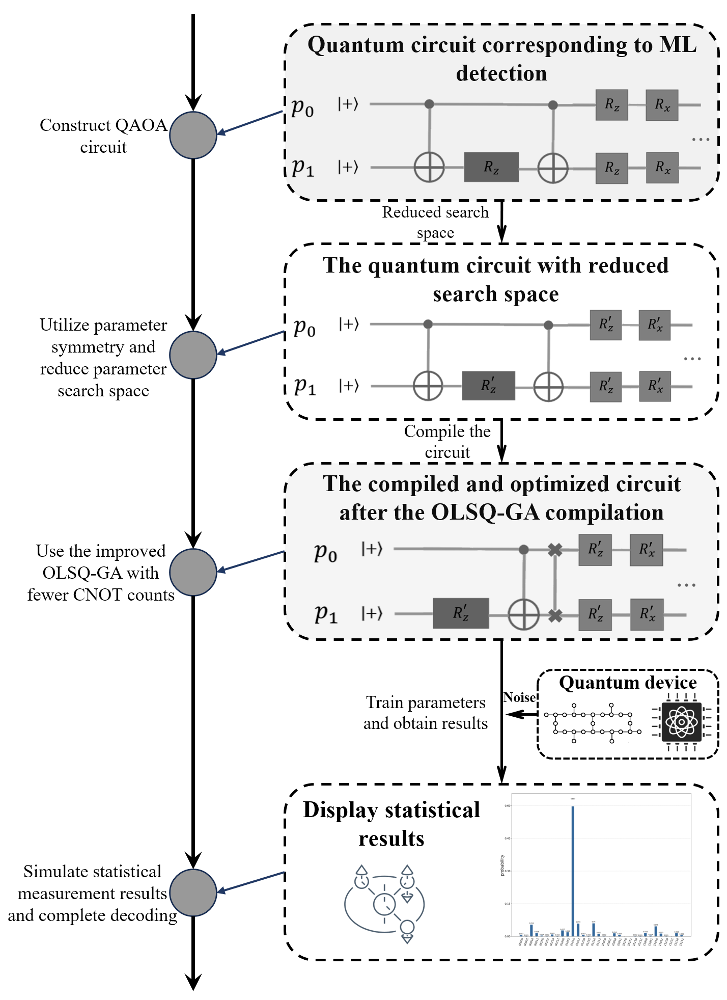
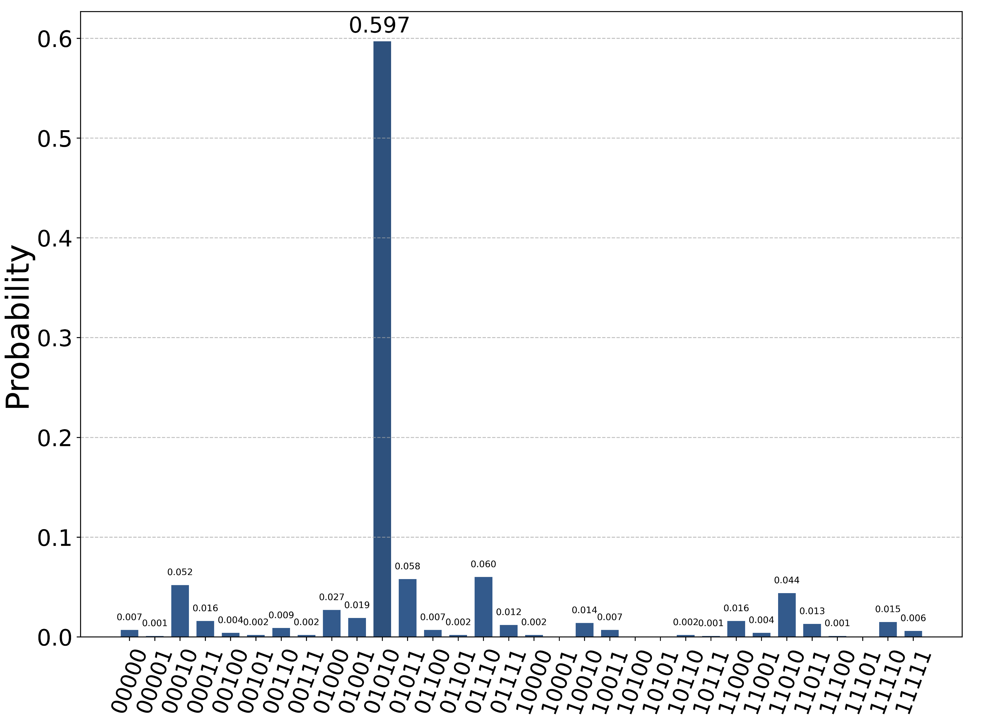
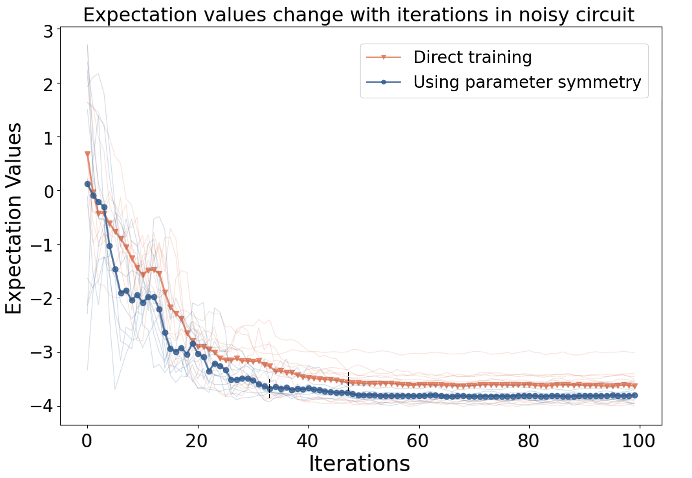
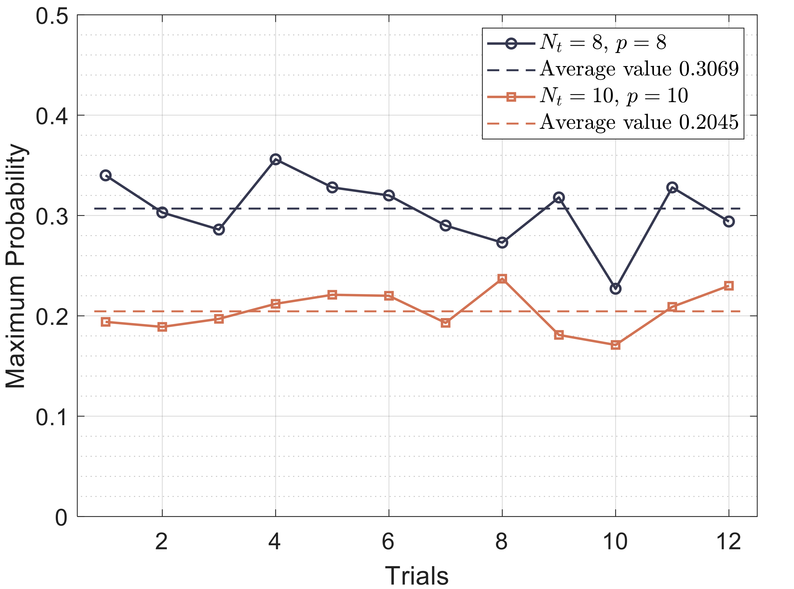
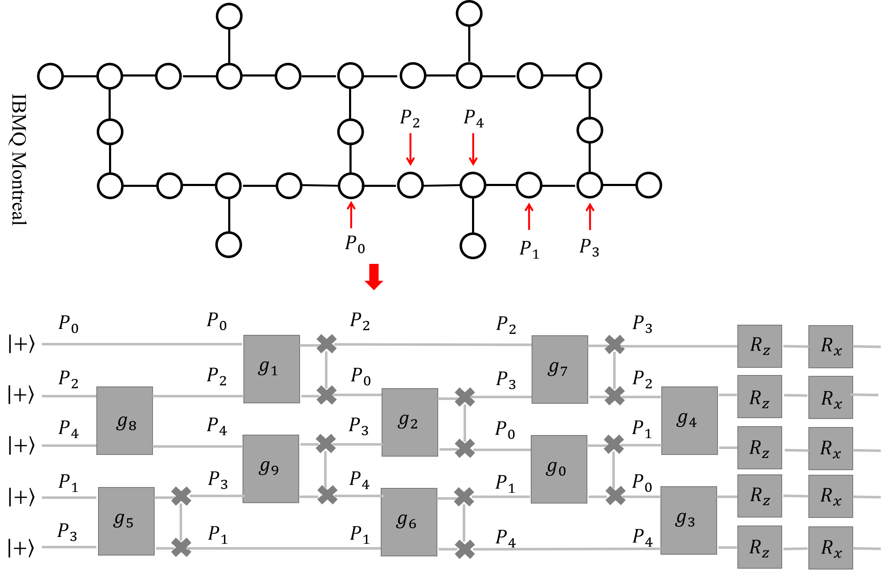
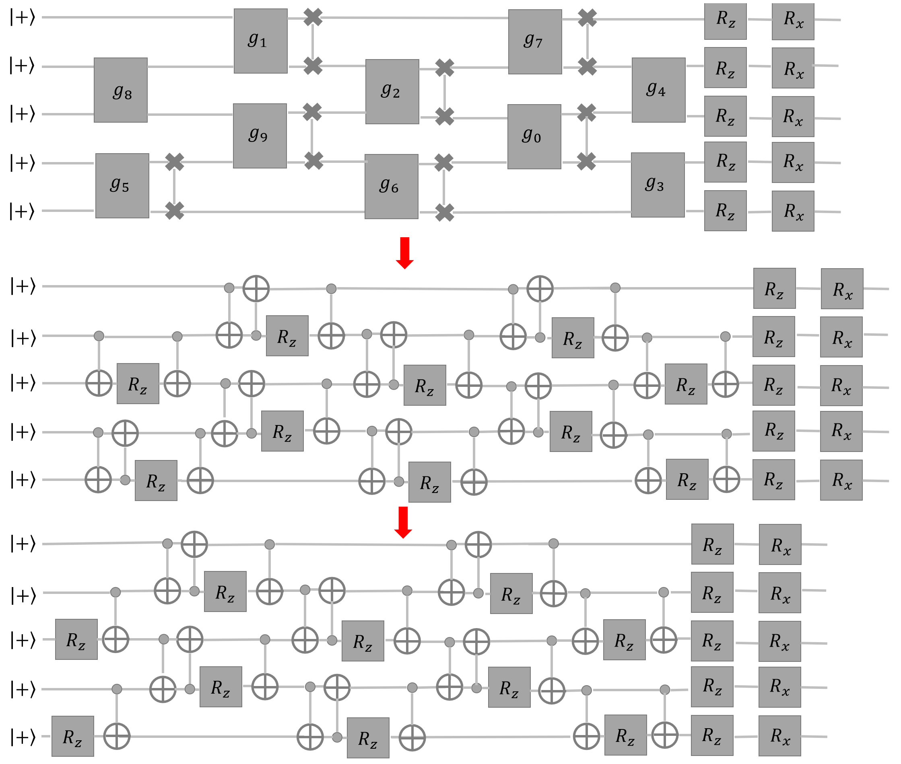

<p align="center">

</p>

<h2><p align="center">A PyThon Library for Quantum Computation and Machine Learning</p></h2>
<h3><p align="center">Updated, Scalable, Easy Implement, Easy Reading and Comprehension</p></h3>


<p align="center">
    <a href="https://github.com/QUANTUM-AND-ML/QAOA-ML-Detection-PLA/blob/main/LICENSE">
        
    </a>
   <a href="https://github.com/QUANTUM-AND-ML/QAOA-ML-Detection-PLA/activity">
        
    </a>
       <a href="https://www.nsfc.gov.cn/english/site_1/index.html">
        
    </a>
    <a href="https://twitter.com/FindOne0258">
        
    </a>


</p>
<br />


## Quantum & Machine Learning
Relevant data for the paper entitled "Rapidly Trainable and Shallow-Compiled Quantum Approximate Optimization Algorithm for Maximum Likelihood Detection"

## Table of contents
* [**Main work**](#Main-work)
* [**Our contributions**](#Our-contributions)
* [**Results display**](#Results-display)
* [**Citation**](#Citation)

## Main work
In multiple-input and multiple-output (MIMO) systems, the maximum likelihood (ML) detection problem is NP-hard and becomes increasingly complex with more transmitting antennas and symbols. The quantum approximate optimization algorithm (QAOA), a leading candidate algorithm running in the noisy intermediate-scale quantum (NISQ) devices, can show quantum advantage for approximately solving combinatorial optimization problems. In this paper, we propose an improved QAOA based maximum likelihood detection. In the proposed scheme, we use ZX-calculus to prove the parameter symmetry in QAOA circuits, which can be used to reduce the search space and accelerate the training process. Moreover, to run QAOA on quantum devices, an improved qubit mapping method with simultaneous gate absorption is proposed, which can compile the quantum circuit of the QAOA to satisfy the connectivity constraints of real quantum devices with fewer CNOT counts. In numerical experiments, our scheme accelerates parameter training by an average of 29.8% and uses fewer CNOT gates and shallower circuit depth during compilation. This demonstrates that our scheme has significant advantages over the traditional scheme.
<p align="center">

</p>

**Figure 1.** The workflow of the improved QAOA based ML detection.

## Our contributions
* Use ZX-calculus to demonstrate that the parameters in the quantum approximate optimization algorithm exhibit symmetry under specific conditions and utilize this symmetry to accelerate parameter training.
* Propose a circuit optimization enhanced qubit mapping method to reduce the number of CNOT gates during circuit compilation.
* Numerical simulations showcase the advantages of the proposed scheme, including accelerated parameter training and reduced CNOT gates and circuit depth during the compilation process.

## Results display

<p align="center">

</p>

**Figure 2.** The decoding result obtained by $N_{t} = 5$, $p = 6$ improved QAOA in the noisy circuit.

<p align="center">

</p>

**Figure 3.** Average convergence curve of the cost function under random channel matrices in the noisy circuit.

<p align="center">

</p>

**Figure 4.** The maximum probability obtained by $N_{t} = 8$ and $N_{t}=10$ in each of the 12 simulations.

<p align="center">

</p>

**Figure 5.** The quantum circuit after the OLSQ-GA compilation.

<p align="center">

</p>

**Figure 6.** The process of quantum circuit optimization.


## Citation
```
- 3.9 >= Python >= 3.7 (Python 3.10 may have the `concurrent` package issue for Qiskit)
- Qiskit >= 0.36.1
- Qiskit-aer >= 0.12.0
- The calculation may require the large amount of RAM
```
